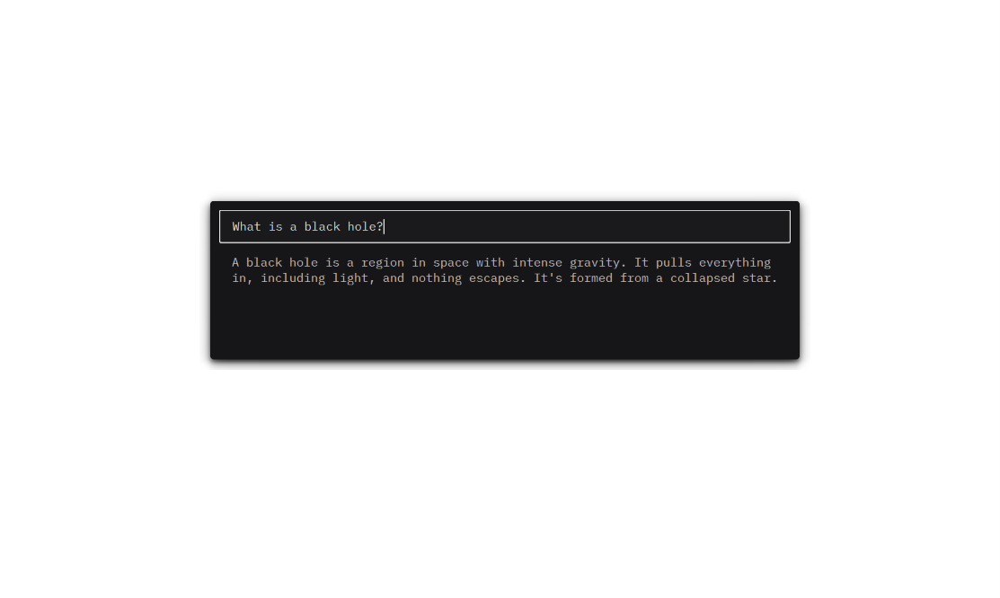
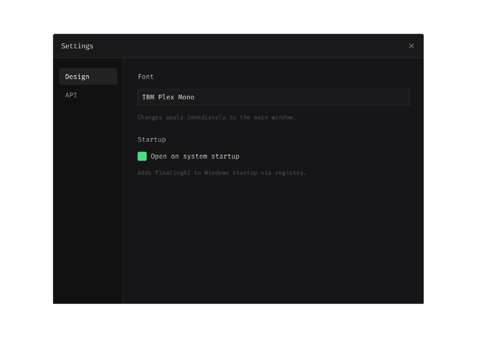
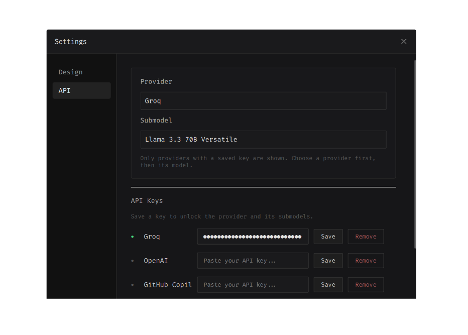

# FloatingAI

Desktop AI assistant for Windows. Press Ctrl+Shift+Space anywhere to open a small input window, type your question, and get an AI response. Esc to close. Runs in the system tray.

I built it because I wanted something lightweight and native — no Electron, no 200 MB installs. Just a single .exe that sits in the tray and pops up when you need it.

Supports Groq, OpenAI, Claude, and Gemini. You configure everything from the Settings window: pick your provider, model, fonts, and enable auto-start. API keys are stored in a local `.env` file.

Built with PySide6, packaged with PyInstaller. The source is about 700 lines across a handful of files.

## Screenshots





## Download

Grab `FloatingAI.exe` from [Releases](https://github.com/flashthb/FloatingAI/releases) and run it. No installation needed.

You'll need an API key from one of the providers. Once you have one, right-click the tray icon → Settings → API and add it.

## Run from source

```bash
git clone https://github.com/flashthb/FloatingAI.git
cd FloatingAI
python -m venv venv
.\venv\Scripts\activate
pip install -r requirements.txt
python main.py
```

## Build your own .exe

```bash
pip install pyinstaller
pyinstaller --noconsole --onefile --name FloatingAI --add-data "assets/fonts;assets/fonts" main.py
```

Output: `dist\FloatingAI.exe`.

## Project structure

```
main.py              Entry point — system tray, hotkey, fonts
ui/
  launcher_window.py   Frameless input window (input + response)
  settings_window.py   Settings dialog (Design + API tabs)
ai/
  client.py            Routes the question to the selected provider
  groq_backend.py      Groq API client
  catalog.py           Provider/model list and env helpers
  worker.py            Runs AI calls in a background thread
  _util.py             Local fallback when no API key is set
hotkeys/
  listener.py          Global hotkey using pynput
config/
  settings.py          Constants (hotkey, window size, max chars)
assets/
  fonts/               Bundled .ttf files
```

## License

MIT
