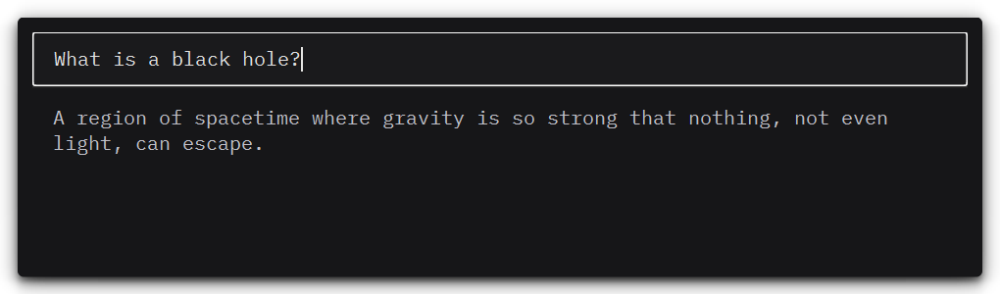
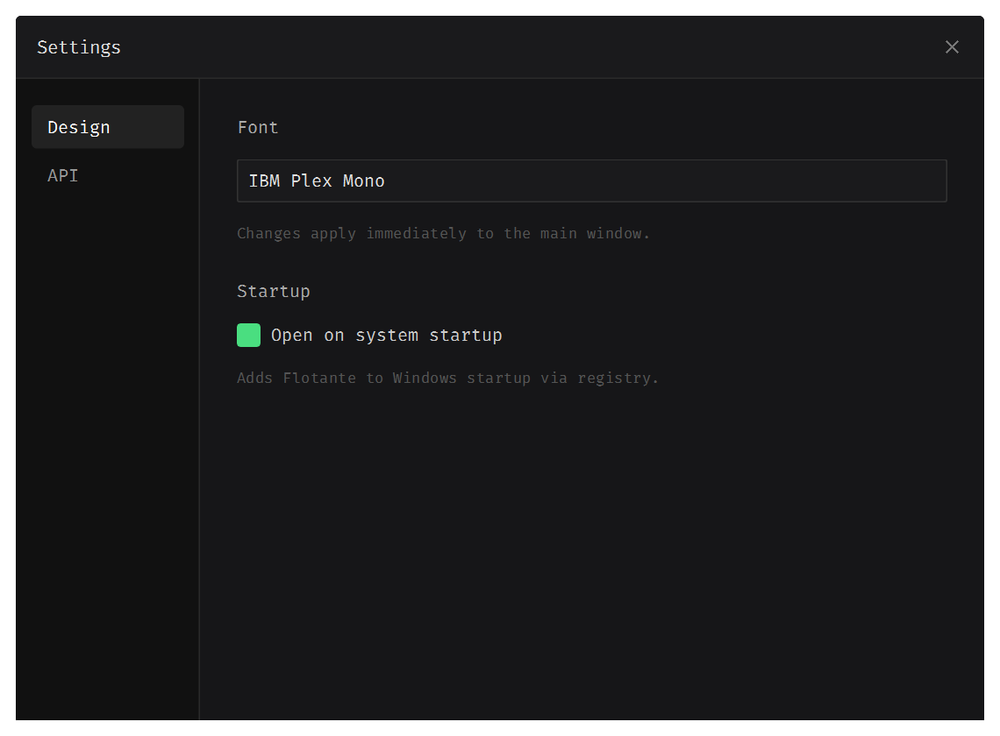
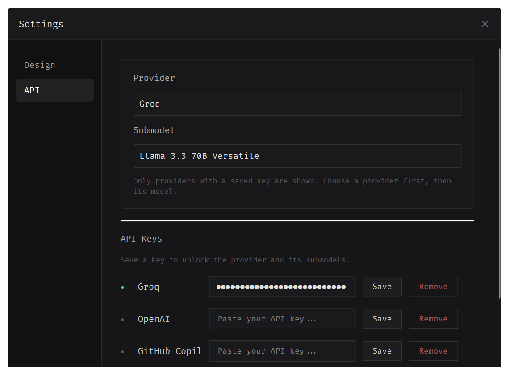

# FloatingAI

Desktop AI assistant for Windows. Press Ctrl+Shift+Space anywhere to open a frameless input window, type your question, and get an AI response. Esc to close. Runs in the system tray.

Supports Groq, OpenAI, Claude, and Gemini. Built with PySide6, packaged as a single portable .exe with PyInstaller. Settings window lets you pick fonts, configure API keys, select provider and model, and enable auto-start with Windows.





## Download

Download `FloatingAI.exe` from [Releases](https://github.com/flashthb/FloatingAI/releases), run it. No installation.

Get an API key from [Groq](https://console.groq.com), [OpenAI](https://platform.openai.com), [Anthropic](https://console.anthropic.com), or [Google](https://aistudio.google.com), then right-click the tray icon → Settings → API.

## Run from source

```bash
git clone https://github.com/flashthb/FloatingAI.git
cd FloatingAI
python -m venv venv
.\venv\Scripts\activate
pip install -r requirements.txt
python main.py
```

## Build .exe

```bash
pip install pyinstaller
pyinstaller --noconsole --onefile --name FloatingAI --add-data "assets/fonts;assets/fonts" main.py
```

Output: `dist\FloatingAI.exe`.

## Structure

```
main.py              Entry point — system tray, hotkey, fonts
ui/
  launcher_window.py   Frameless input window (input + response)
  settings_window.py   Settings dialog (Design + API tabs)
ai/
  client.py            AI dispatch — routes to active provider or fallback
  groq_backend.py      Groq API client (OpenAI-compatible)
  catalog.py           Provider/model registry and env helpers
  worker.py            QRunnable for background AI calls
  _util.py             Local simulator fallback
hotkeys/
  listener.py          Global hotkey (pynput wrapper)
config/
  settings.py          Constants (hotkey, window size, max chars)
assets/
  fonts/               Bundled .ttf files
```

## License

MIT
